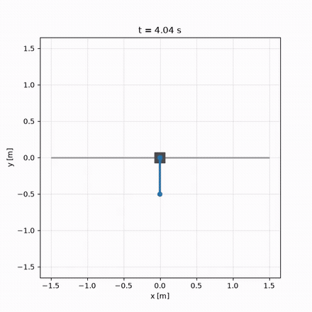
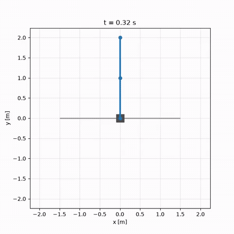

# Pendulum Control

*Underactuated-pendulum control, built from the math up — hand-rolled LQR &amp; MPC,
energy-shaping swing-up, and a real-time interactive simulator.*

<p align="center">
  
  
  
  
</p>

<p align="center">
  
  &nbsp;
  
</p>
<p align="center">
  <sub><b>Left:</b> energy-shaping swing-up from a dead hang, caught and balanced by LQR.
  &nbsp;·&nbsp; <b>Right:</b> LQR rejecting a 180&nbsp;N impulse shove and re-centering the cart.</sub>
</p>

A progression of controllers that stabilize and swing up an underactuated pendulum, each
**derived from the theory and cross-checked against it** — a hand-rolled continuous-time
Riccati solver, a condensed-QP model-predictive controller, and Åström–Furuta
energy-shaping swing-up with a hybrid catch. Simulation and rendering are decoupled, so
every run is deterministic and testable.

**Stack:** Python · NumPy (hand-rolled control math) · osqp · pygame · Docker · pytest

## Highlights

- **LQR** — continuous-time Riccati (CARE) solved *by hand*: a Hamiltonian-eigenvector
  seed refined by Newton–Kleinman iteration, cross-checked against SciPy.
- **Linear MPC** — a *condensed* QP (state eliminated) solved with `osqp` and warm
  starts, with hard input &amp; rail constraints and a **DARE terminal cost** that makes the
  finite-horizon MPC *exactly* the infinite-horizon discrete LQR when unconstrained.
- **Energy-shaping swing-up** — Åström–Furuta energy pumping + collocated partial-feedback
  linearization, handed to an LQR/MPC **catch** by a hysteretic, region-of-attraction
  **mode switch**. Swings up from a dead hang and balances, robustly from any state.
- **Underactuation, three ways** — one dynamics core with a configurable actuation matrix
  `B`: a fully-actuated arm, an **Acrobot** (elbow-only), or a **Pendubot** (shoulder-only).
- **Real-time interactive UI** (pygame) — a launcher menu and a live sim you can **drag
  with the mouse**, **hot-swap controllers mid-run**, and steer with a right-click target.
- **Hardware-portable architecture** — the controller / estimator / sensor code never
  imports the simulator; the sim is just one driver of those interfaces, so the identical
  control code would run on real hardware.
- **262 tests** — physics oracles (energy conservation, a symbolic Euler–Lagrange
  cross-check, finite-difference vs. analytic linearization) and control cross-checks
  (LQR vs. SciPy, MPC vs. its unconstrained LQR limit).

## Controllers

| Controller | Status | Notes |
|---|---|---|
| LQR (Riccati) | ✅ | hand-rolled CARE — [design note](docs/design-notes/lqr-riccati.md) |
| Linear MPC (QP) | ✅ | condensed QP, `osqp`, DARE terminal cost — [design note](docs/design-notes/linear-mpc.md) |
| Energy-shaping swing-up + catch | ✅ | Åström–Furuta + hybrid mode switch — [design note](docs/design-notes/energy-swingup.md) |
| Pole placement, LQG / observer | scaffold | documented stubs |

Both clips at the top run through these controllers unmodified. The swing-up is a genuine
nonlinear energy-shaping law that hands off to the *linear* LQR/MPC catch through a
region-of-attraction test; the disturbance-rejection clip shoves the LQR-balanced double
pendulum with a 180&nbsp;N impulse — sized by a measured sweep to land just inside the
basin of attraction (190&nbsp;N recovers, 200&nbsp;N tips it over the top).

Each controller carries a short **design note** — the decision, the alternatives
considered, why this one, and its failure modes — under
[`docs/design-notes/`](docs/design-notes/). The interactive UI has a
[design note](docs/design-notes/interactive-ui.md) too.

## Plants

One planar dynamics core drives three plants, each a registered `Plant` behind a common
protocol:

- **Fixed-pivot double pendulum** — state `[θ₁, θ₂, θ̇₁, θ̇₂]`, with the configurable-`B`
  actuation (fully-actuated / Acrobot / Pendubot).
- **Single-pole cart-pole** — state `[x, θ, ẋ, θ̇]`, force on the cart; the swing-up demo.
- **Cart-mounted double pendulum** — state `[x, θ₁, θ₂, ẋ, θ̇₁, θ̇₂]`, force on the cart;
  an underactuated ℝ⁶ system, regulated near upright by LQR/MPC (shown above).

## Quick start

Docker-based, no `sudo` anywhere:

```bash
./run build                  # once: builds the image
xhost +si:localuser:$USER    # once per login session: lets the container open a window

./run                        # launcher menu — pick a plant, controller, and start state
./run ui --plant cartpole --controller swingup --start hanging   # swing up & balance, directly
./run batch scenarios/cart_disturbance_recovery.py               # a batch scenario → telemetry
./run test                                                       # the 262-test suite
```

In the UI: **drag the cart** with the mouse, click a controller in the on-screen strip to
**hot-swap it live**, **right-click** to set a cart target. Selecting `lqr`/`mpc` on the
cart-pole automatically swings up from hanging and then balances — the mode is governed
entirely by which controller is selected.

## Architecture

One control tick flows `sensor → estimator → controller → zero-order-hold → plant`, with
every signal tapped for telemetry. The controller always consumes an *estimate*, never
ground truth, so adding an observer (LQG) is a config swap, not a rewrite; the swing-up
hand-off is the same idea (a `ModeSwitch` is just a `Controller` that delegates). See
[`docs/ARCHITECTURE.md`](docs/ARCHITECTURE.md) for the module map, the acyclic dependency
rules, and the unit / frame conventions.

## Testing

`./run test` runs 262 tests. Dynamics are verified against oracles — energy conservation
(zero input, zero friction), a symbolic Euler–Lagrange derivation of `M, C, g`, and
finite-difference vs. analytic linearization — and controllers are cross-checked (LQR
against `scipy.linalg.solve_continuous_are`, MPC against its unconstrained LQR limit).

## License

MIT — see [LICENSE](LICENSE).

---

*Developed with AI pair-programming assistance (Claude / Claude Code).*
